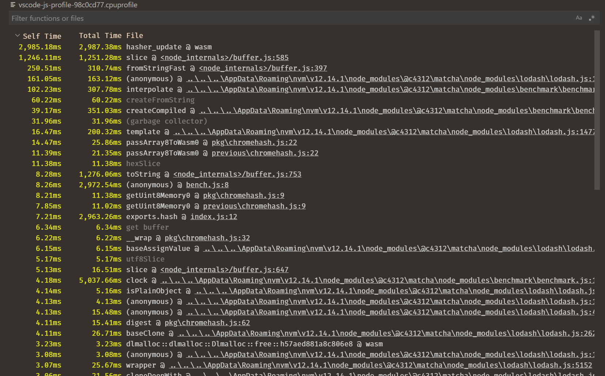

# vscode-js-profile-visualizer

A custom editor for viewing `.cpuprofile` files in VS Code. Pairs well with out new [JavaScript debugger](https://github.com/microsoft/vscode-js-debug).

## Contributing

This is a Lerna monorepo, with a core package that shares data models and some UI between extensions.

- You can use `npm run watch` to watch _everything_, or, for example, `npm run watch:flame`, to only watch changes to the flame graph extension.
- Extensions can be viewed as standalone pages in the browser for rapid development via `npm run standalone:flame`
- There's a launch config that runs all extensions.
- `npm run compile`, again with scopes like `compile:flame`, create static compilations of various packages.
- If you need to install a dependency in one package, you can use `lerna add`, or add it to the package.json and then run `lerna bootstrap`.
